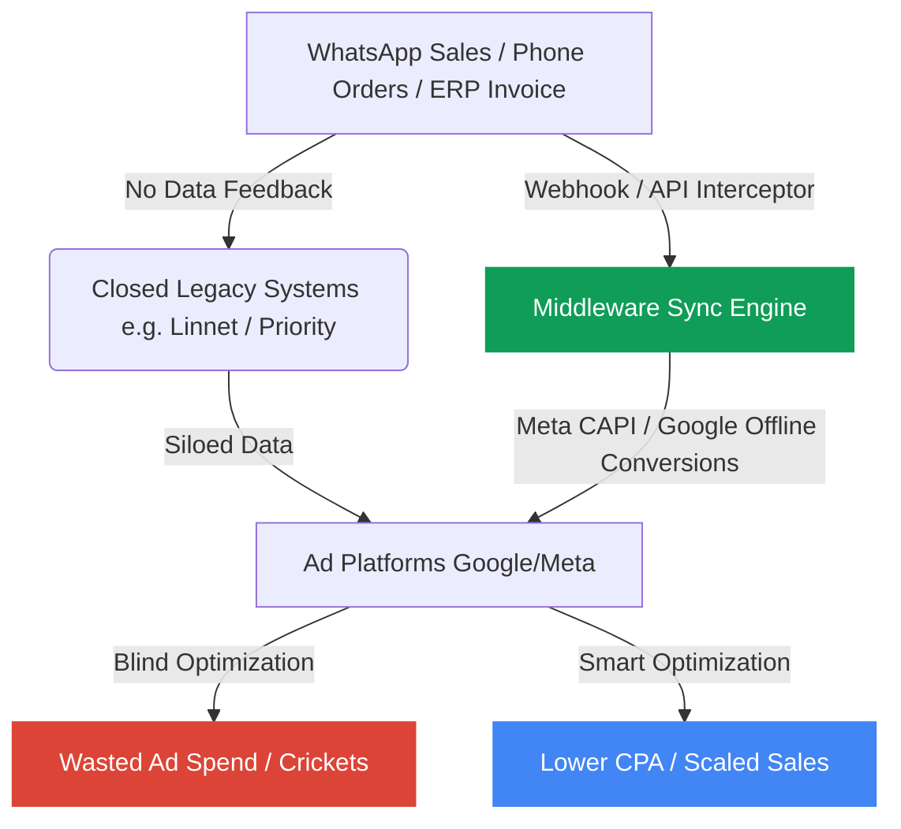

# E-commerce Pain Points & Opportunities Analysis

This report is based on the analysis of `results.csv`, which contains **331 extracted problem reports** from a WhatsApp group of Israeli e-commerce site owners (primarily using Shopify, WooCommerce, and various billing/ERP platforms).

---

## 📊 Quantitative Overview

Our analysis of the extracted data shows a clear distribution of pain points across the e-commerce lifecycle:

### 1. Top Problem Categories
- **Payments & Billing** (32 records): Glitches, high/hidden processing fees, lack of billing transparency, Apple Pay/tourist card issues, and delayed payout cash-flow constraints.
- **Logistics & Delivery** (22 records): Courier unreliability, lost packages, and high return rates due to pickup notifications failing to reach customers.
- **Marketing & Analytics** (17 records): Ineffective ad spend due to data silos, upcoming ad platform restrictions, and poor native reporting.
- **Legal & Compliance** (16 records): Looming panic over Israel's Privacy Law (Amendment 13), Spam Law lawsuit threats, and shipping refund obligations.

### 2. Severity Breakdown
- **High Severity:** 140 reports (42.3%) — Issues causing direct financial loss, operational blockages, or high legal risks.
- **Medium Severity:** 156 reports (47.1%) — Inefficiencies, poor customer experiences, and integration friction.
- **Low Severity:** 35 reports (10.6%) — One-off questions, recommendations, or minor aesthetic complaints.

---

## 💡 Top 3 Commercial Opportunities

Based on severity, frequency, and **commercial value (ROI impact)**, we have identified three significant opportunities worth solving for this audience.

---

### Opportunity 1: The "Closed-Loop" Conversion Tracker (Marketing & Data Integration)

#### The Pain Point
Many Israeli merchants use legacy billing, ERP, or call center systems (e.g., Linnet, Priority, Cash Cow) to handle sales, particularly those originating from WhatsApp or phone consultations. These systems are "closed" and do not feed purchase and user data back to ad platforms (Google Ads, Meta Conversions API). Consequently, ad algorithms optimize blindly ("shooting in the dark"), leading to high acquisition costs (CPA) and a growth ceiling.
> **Quote:** *"In a closed system, you don't have a user ID or conversion value for the user's flow... Legacy closed systems don't return the data back, so the campaigns don't know what happened, and you shoot in the dark."*

#### Proposed Solution: CAPI & Offline Event Bridge
A lightweight integrations middleware that connects Israeli legacy systems (via database hooks, webhook listeners, or CSV auto-parsers) to **Meta Conversions API (CAPI)** and **Google Ads Offline Conversion Tracking**.
- **Key Features:**
  - Standardized webhooks connecting CRM/ERP platforms to Facebook Pixel/Google Ads.
  - Automatic deduplication of offline/phone sales against online click IDs (using phone/email hash).
  - A dashboard displaying actual blended ROAS across all sales channels.

#### Commercial Value / ROI
An e-commerce store spending $5,000/month on ads can easily lose 20-30% of conversion signals due to offline/phone closing. Recovering these signals allows Meta/Google algorithms to optimize targeting, typically reducing CPA by **15-25%**, saving the merchant $750–$1,250/month in ad waste alone.

---

### Opportunity 2: Courier "Watchdog" & Smart Notification Engine (Logistics & Customer Support)

#### The Pain Point
Customers frequently fail to collect packages from pickup points because they claim they never received the courier’s SMS/WhatsApp notification (or ignored it). After 5 days, the package is automatically returned. The merchant is billed for the return shipping, has to pay for re-shipping, and faces angry customer disputes, all while manually checking courier websites daily to catch delays.
> **Quote:** *"Customers always say they didn't get the message... The shipping company charges you for the return. Quite a few times I have disputes with customers... I have to check shipping sites daily."*

#### Proposed Solution: Multi-Carrier Delivery Guard
A Shopify/WooCommerce app that aggregates tracking data from all major Israeli delivery companies (Cheetah, Katz, HFD, Israel Post) and takes control of the customer communication loop.
- **Key Features:**
  - Automated API polling of shipping statuses.
  - Custom, branded WhatsApp/SMS alerts sent directly from the merchant's business account (e.g., "Your package has arrived! It expires in 3 days").
  - Proactive "Alert Dashboard" highlighting packages near expiration, allowing customer service to call them before they are returned.
  - Automatic collection of proof-of-delivery (signed slips) to protect merchants from payment disputes.

#### Commercial Value / ROI
Every returned package costs the merchant ~35-70 NIS in return and re-shipping fees, plus lost customer trust. A store processing 1,000 shipments a month with a 3% uncollected return rate loses over 1,500 NIS ($400) monthly. Cutting this rate by 70% pays for the service instantly.

---

### Opportunity 3: Compliance Shield for Israel's Amendment 13 (Legal & Risk Mitigation)

#### The Pain Point
Store owners are terrified of potential lawsuits and regulatory fines due to non-compliance with the new privacy law. However, they are highly confused by the legal jargon, copying incorrect policies from other sites, and struggling with cookie banners that drop marketing tracking by 25-35%.
> **Quote:** *"On 14.8.25, Amendment 13 will enter into force, and like the accessibility law - a wave of lawsuits against site owners is expected to start... An site with a form, pixel, or analytics without structured disclosure = invitation for serial plaintiffs."*

#### Proposed Solution: Dynamic Hebrew Compliance Engine
A plug-and-play legal compliance suite designed specifically for the Israeli market.
- **Key Features:**
  - **Auto-Scanner:** Scans the website to identify all tracking scripts (Facebook Pixel, TikTok Pixel, GA4, Hotjar).
  - **Dynamic Policy Generator:** Generates a Hebrew privacy policy draft verified by Israeli tech lawyers, auto-updating whenever new pixels are detected.
  - **Opt-in Optimizer:** A legal cookie consent banner optimized for Hebrew UI/UX, designed to maximize opt-in rates (minimizing data loss) while ensuring 100% legal compliance.
  - **Proof of Consent Log:** Securely logs consent timestamps to protect the merchant in court against serial plaintiffs.

---

## 📈 Summary Recommendation Matrix

| Opportunity | Complexity | Time to Market | Commercial Value | Target Audience Size |
| :--- | :---: | :---: | :---: | :---: |
| **1. Conversion Sync Bridge** | Medium-High | 6-8 weeks | **Extremely High** | Large/Mid-sized stores with offline/sales teams |
| **2. Courier Notification Engine** | Medium | 4-6 weeks | **High** | All stores utilizing local pickup points |
| **3. Amendment 13 Compliance** | Low-Medium | 3-4 weeks | **High (Time-Sensitive)** | Every single Israeli e-commerce website |

---

### Next Steps for Product Design
1. **Choose a direction:** The **Amendment 13 Compliance Shield** is the most time-sensitive (August 2025 deadline) and easiest to build quickly. The **Conversion Sync Bridge** represents the largest long-term business and highest customer lifetime value (LTV).
2. **Technical Feasibility Study:** Review API documentations for key local systems (Priority API, Linnet, Cash Cow, Cheetah, HFD).
