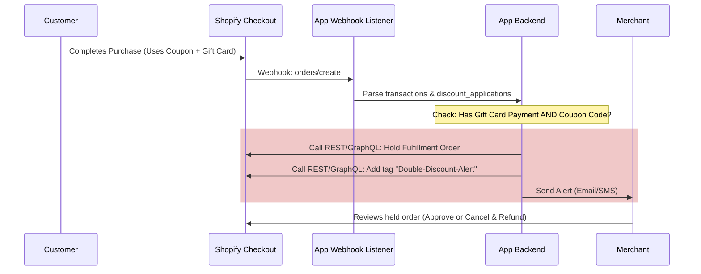

# Implementation Plan: Shopify Gift Card & Promotion Guard (POC)

This document outlines the design, architecture, and step-by-step implementation plan for a mass-market Shopify App designed to prevent margin leakage from double-discounting (coupon codes stacked with gift card payments) on **Shopify Basic and Standard plans**.

---

## 1. The Challenge & Technical Breakthrough

### The Shopify Basic Limitation:
On Shopify Basic/Standard plans, the core checkout steps are locked. We **cannot** use Checkout UI Extensions to inspect payment methods in real-time or dynamically strip discount codes when a gift card is applied. 

### The Solution (Backend Guard & Auto-Hold):
Instead of fighting the locked checkout page, the app acts as a **Real-Time Order Auditor**:
1. **Frontend Deterrent (Theme App Extension):** A lightweight Javascript snippet is injected into the cart page. It checks if the cart contains a Gift Card and warns the user that discounts cannot be stacked.
2. **Post-Purchase Verification (Webhooks):** The moment an order is placed, the app receives an `orders/create` webhook.
3. **Instant Validation:** The app backend checks if:
   - A discount code was applied to the order.
   - A gift card transaction was used to pay for the order.
4. **Auto-Hold & Tagging:** If a violation is detected, the app uses Shopify's **Fulfillment Order Hold API** to automatically place the order on hold, tags it as `Double-Discount-Alert`, and alerts the merchant via SMS/Email. This prevents automated fulfillment centers (or staff) from shipping the product at a loss.

---

## 2. Proposed System Architecture

### Key Components to Build:
*   **App Backend (Node.js/Remix):** Official Shopify app framework to handle OAuth, merchant billing subscription ($9–$29/month), and webhook processing.
*   **Database (SQLite for POC, PostgreSQL for Production):** To store merchant rules (e.g., "Hold order if discount > 10% + Gift Card").
*   **Fulfillment Hold Engine:** Job queue to process `orders/create` webhooks within seconds and apply holds.
*   **Merchant Portal (Shopify Polaris UI):** A simple dashboard inside the Shopify Admin where the merchant can:
    - Toggle the "Double Discount Guard" on/off.
    - View all "Held" orders and the exact amount of margin saved.
    - Set up automated customer notifications (e.g., "Politely notify customer that their order is held").

---

## 3. Step-by-Step Implementation Steps

### Phase 1: Environment Setup (Days 1–3)
- [ ] Initialize Shopify App project using CLI (`npm init @shopify/app@latest`).
- [ ] Configure Remix template and local tunneling (Cloudflare/Ngrok).
- [ ] Set up database schema for merchant configuration and logged violations.

### Phase 2: Webhook & Hold Engine (Days 4–7)
- [ ] Register `orders/create` webhook subscription.
- [ ] Write logic to parse order JSON for:
  - `discount_codes` (non-empty list).
  - `payment_gateway_names` containing `gift_card` or transaction entries of type `gift_card`.
- [ ] Implement Shopify GraphQL mutation to place the corresponding `FulfillmentOrder` on hold with the reason `OTHER`.
- [ ] Implement mutation to add the `Double-Discount-Alert` tag.

### Phase 3: Storefront Theme App Extension (Days 8–10)
- [ ] Build a Theme App Extension (App Block) for the Cart page.
- [ ] Write vanilla JS to detect if a Gift Card product is in the cart and show a customized, localized alert message (Hebrew/English).

### Phase 4: Merchant Dashboard (Days 11–14)
- [ ] Create the Admin UI using React and Shopify Polaris components.
- [ ] Add configuration toggles (Enable Guard, Auto-Hold, Email Notifications).
- [ ] Create a log table showing recently held orders and saved margins.

---

## 4. Verification & Testing Plan

### Automated Tests
*   Mock webhook payloads testing all combinations:
    - Order with Gift Card only (Should Pass).
    - Order with Discount Code only (Should Pass).
    - Order with Gift Card + Discount Code (Should Hold).

### Manual Verification
1. Install the POC app in a Shopify partner development store.
2. Place a test order using a 10% discount code and paying the balance with a gift card.
3. Verify that:
   - The fulfillment status immediately changes to **On Hold**.
   - The tag `Double-Discount-Alert` is applied.
   - The dashboard log displays the violation.

---

## 5. User Review Required & Open Questions

> [!IMPORTANT]
> **Open Question for User Review:**
> When an order is placed on hold due to a double-discount violation, what is the best default action for the customer?
> - **Option A (Passive):** Place on hold, tag, and let the merchant manually email or call the customer to resolve. (Easiest to build for POC).
> - **Option B (Semi-Automated):** Automatically send a template email to the customer explaining the policy, offering a quick payment link to pay the difference, or a 1-click cancel button. (Adds 3-4 days of dev effort).
