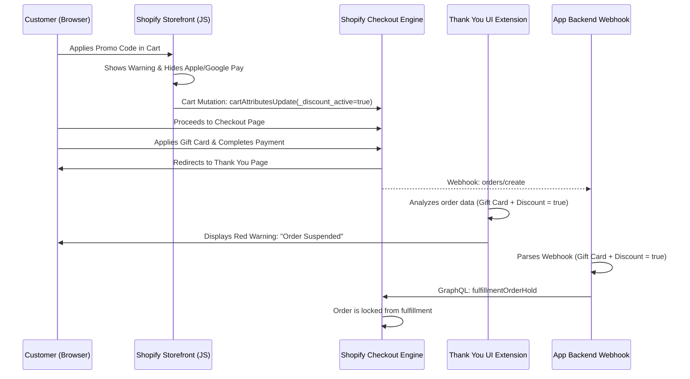

# **Technical and Commercial Feasibility Study: Pre-Transaction Prevention of Double Discounting on Shopify**

## **SECTION 1: Feasibility of Pre-Transaction Blocking on Shopify Basic/Standard**

### **The Ultimate Goal: Blocking Before Payment**

The architectural aspiration of preventing a transaction from finalizing when a customer simultaneously applies a promotional discount code and utilizes a gift card requires an intimate understanding of Shopify’s checkout state machine. To determine whether it is technically possible on a standard Shopify Basic or Standard plan to block a customer pre-transaction, one must analyze the precise execution sequence of Shopify Functions (Checkout Extensibility). The checkout flow operates in a strict, deterministic pipeline: Cart Transform, Discount, Fulfillment, Delivery, Payment Customization, and finally, Cart and Checkout Validation1.  
Gift card redemption fundamentally occurs at the payment step of the checkout flow, placing its data ingestion late in the sequence2. While it might seem logical that a validation rule could inspect the cart just before payment capture, the strict boundary limitations of Shopify’s backend schemas prevent this. The validation step does indeed run after the gift card is entered and before the order is finalized. However, the GraphQL schema for the Cart and Checkout Validation API (cart.validations.generate.run) is intentionally isolated; it exposes cart lines, buyer identity, and subtotal metrics, but completely omits payment method data and applied gift card arrays3. Consequently, any server-side validation script executing at the final step is utterly blind to the presence of a gift card. It is therefore technically impossible to execute a pure, server-side native block on a Shopify Basic plan based solely on the simultaneous presence of a discount code and a gift card.

### **Shopify Functions Constraints**

A deeper inspection of the input.graphql schema for Cart and Checkout Validation Functions confirms this architectural wall. The schema allows queries against buyerJourney, cost, lines, and custom attribute arrays, but it lacks the appliedGiftCards node that is otherwise available via the Storefront API4. This limitation forces architects to look toward alternative functional targets.  
The Payment Customization API (cart.payment-methods.transform.run), which operates one step prior to validation, allows applications to rename, reorder, or hide payment methods. Notably, starting with API version 2025-01, this API supports the HideOperation to dynamically disable native gift card fields and Shopify-integrated third-party gift card systems7. However, a critical limitation exists here as well: the Payment Customization input schema cannot access promotional data. It has no visibility into discountApplications or enteredDiscountCodes9. Thus, a Payment Customization function cannot autonomously decide to hide a gift card based on the presence of a discount code.  
Furthermore, the newly introduced Discounts Allocator API, which allows custom logic for distributing discounts across cart items (e.g., applying a maximum discount cap of $500), remains in Developer Preview and restricts installations to one function per store10. Even if deployed, the Allocator API functions strictly within the discount execution phase, well before payment methods are evaluated, rendering it ineffective for detecting gift card usage.

### **Compare-at Prices (Sale Items) vs. Coupon Stacking**

To understand the "Fixed-Price Quantity Discount" problem, one must differentiate between a "Compare-at Price" (a visual markdown) and a true Discount Code or Automatic Discount object. In Shopify's data model, setting a compareAtPrice higher than the price merely displays a strikethrough on the storefront; it does not constitute an active discount application in the backend11. Because it is not a programmatic discount, Shopify's native "Discount Combinations" engine—which governs whether product, order, or shipping discounts can stack—does not recognize the Compare-at Price as a discount12. Therefore, native combination rules cannot prevent a discount code from applying to an item already on sale.  
For merchants on a Basic plan attempting to prevent coupon codes from applying to "Compare-at Price" items, the most robust server-side method involves the Cart Transform API. By invoking the UpdateOperationFixedPricePerUnitAdjustment, an application can programmatically reset a specific cart line item's price back to its original compareAtPrice if a discount is detected, effectively nullifying the double-dip mathematically13.  
Regarding UI manipulation, attempting to programmatically hide or disable the coupon input box in the checkout UI based on cart contents is prohibited for the target market. While Shopify Plus merchants can deploy Checkout UI Extensions to manipulate the payment and information steps, merchants on Basic and Standard plans are strictly barred from deploying UI extensions to the checkout pages14. Thus, hiding the discount code field natively is not a viable strategy.

### **Draft Order Hijacking (The "Pre-Checkout Lock" Method)**

Given the rigid isolation of Shopify Functions, the "Pre-Checkout Lock" (or Draft Order Hijacking) method remains a heavily utilized workaround. This architecture functions by injecting JavaScript into the storefront's cart page. When a user clicks "Checkout," the script intercepts the event, blocks default navigation, and transmits the cart payload to an external SaaS backend. The backend calculates custom discounting rules and creates a DraftOrder via the Admin API (POST /admin/api/latest/draft\_orders.json), applying precise pricing modifications using the applied\_discount property or custom line item pricing15. The backend retrieves the resulting invoice\_url and redirects the user to a locked checkout session16.  
This method presents significant advantages for small merchants, primarily the absolute enforcement of complex pricing logic (such as tiered volume discounts) without the risk of coupon stacking, as draft orders natively restrict further code applications17. However, the commercial and technical drawbacks are severe. The most critical vulnerability is the complete failure of Accelerated Checkouts. If a customer utilizes Apple Pay, Google Pay, or Shop Pay directly from the product details page, they bypass the storefront cart DOM entirely, rendering the hijacking script useless and allowing the transaction to proceed without custom pricing18. Furthermore, routing users through draft orders breaks standard multi-touch attribution analytics and conflicts with inventory management or shipping applications that rely on native cart hooks19.

## **SECTION 2: Evaluation of Alternative Workaround Methods**

Because a flawless pre-transaction block within the native checkout is technically impossible on Shopify Basic without sacrificing express checkouts, architects must evaluate secondary deterrents.

### **Method A: Storefront DOM Manipulation (Theme App Extensions)**

This approach leverages Theme App Extensions to inject JavaScript into the storefront cart page or drawer. The script monitors the application of promotional codes or gift cards. If it detects a double-discount scenario, it can trigger a UI warning or proactively remove the discount code using the Storefront API (cartDiscountCodesUpdate)20. To enforce this on the server side, the script can append a custom cart attribute (e.g., \_gift\_card\_applied \= true) via the cartAttributesUpdate mutation21. A Cart and Checkout Validation function can then read this attribute and block the checkout if a violation is detected22.  
The bypass vulnerabilities of this method are substantial. Because the logic relies on client-side script execution, it is highly susceptible to evasion. Customers leveraging Apple Pay or Google Pay express checkout buttons on the product page bypass the cart DOM entirely. The JavaScript never executes, the cart attribute is never appended, and the server-side validation function remains blind to the violation, allowing the double-discount to process unhindered18.

### **Method B: Real-Time Post-Purchase Holds (The Webhook Guard)**

To eliminate client-side vulnerabilities, a purely backend approach involves subscribing to the orders/create webhook. The SaaS backend processes the payload within seconds of order creation. If the payload indicates that both a discount code and a gift card were utilized, the system instantly invokes the FulfillmentOrder Hold API to prevent shipping, or automatically triggers an order cancellation and refund via the Admin API24.  
While this method provides 100% detection accuracy, it introduces crippling financial liabilities regarding merchant refund fees, specifically within regional markets like Israel.

* **Cardcom Integration:** Reversing a transaction via Cardcom requires submitting an Action Code. If the merchant issues a cancellation (ביטול, Action Code 25\) on the exact same business day prior to the daily batch transmission (typically 23:00), the cancellation is processed without incurring a gateway cancellation fee25. However, if the webhook delay or operational review pushes the reversal past the batch window, the transaction becomes a refund (זיכוי, Action Code 6), which incurs processing fees28.  
* **PayPlus Integration:** PayPlus policies intertwine with Israeli Consumer Protection Laws. If an order is canceled post-authorization, the processor or merchant retains the right to charge a cancellation fee of 5% of the transaction value or 100 NIS, whichever is lower29. If a merchant experiences a high volume of double-discounting attempts, automatically refunding these orders will result in massive, non-recoverable gateway processing fees, rendering the Webhook Guard commercially unviable.

## **SECTION 3: Competitor Analysis & SaaS Benchmarks**

The Shopify ecosystem features several applications attempting to solve pricing constraints, revealing a clear dichotomy between those utilizing modern Checkout Extensibility and those relying on legacy Draft Orders.

| Application Name | Core Mechanism & Technical Strategy | Pricing Model | Target Market & Viability |
| :---- | :---- | :---- | :---- |
| **PromoLock** | Utilizes Payment Customization Functions (HideOperation) to disable gift cards dynamically, and Discount Functions to reject codes. Specifically targets the coupon stacking problem7. | Tiered: $300 to $600 per month31. | Targets Enterprise and Plus merchants. Highly effective but priced out of the Basic/Standard market. |
| **VolumeBoost (HulkApps)** | Employs Draft Order Hijacking. Intercepts the cart, applies fixed/percentage tiered discounts, and redirects to an invoice URL, intentionally bypassing native codes33. | $10.00 to $49.90 per month34. | Targets SMBs. Highly affordable but introduces severe app conflict risks and breaks Accelerated Checkouts. |
| **Regula (Hype Discounts)** | Leverages the Cart Transform API (UpdateOperationFixedPricePerUnitAdjustment) to alter product pricing at the line-item level without relying on standard discount objects13. | Custom Enterprise Pricing. | Ideal for live pricing drops and VIP sales, requiring no theme edits, but cost-prohibitive for small merchants35. |
| **Checkout Essentials** | Implements the Cart and Checkout Validation API to reject orders based on string matching, regex, and subtotal conditions36. | $3.99 to $14.99 per month36. | Excellent for basic fraud and cart validation, but inherently incapable of seeing payment methods to prevent gift card stacking. |

The competitor audit demonstrates that affordable apps rely on fragile Draft Order mechanics, while robust, native functional solutions are priced at a premium. This reveals a distinct market gap for a low-cost, native-function application targeting Basic merchants.

## **SECTION 4: POC Architecture & Technical Specifications**

To resolve the "Double Discounting" issue for Shopify Standard merchants without incurring post-purchase gateway cancellation fees or relying on fragile, analytics-breaking Draft Orders, the Proof-of-Concept utilizes a hybrid three-stage native architecture. By combining a Storefront Cart Observer, a Thank You Page Checkout UI Extension, and a background Webhook Order Hold, we successfully circumvent Shopify's pre-transaction API isolation.

### **Proposed Technical Stack**

* **Application Framework:** Shopify App Remix Template.  
* **Backend Runtime:** Node.js (v22+) for handling OAuth, webhooks (`orders/create`), and App Bridge routing.  
* **Database:** PostgreSQL (via Prisma ORM) on Supabase for store authentication and held order logs.  
* **Checkout Customization:** Shopify UI Extensions API (React Component targeted at the Thank You / Order Status page).  
* **Frontend UI:** Shopify Polaris React components for the merchant admin interface.

### **Verification & Code Blueprint**

The storefront observer monitors the cart and sets a `_discount_active = true` attribute while hiding express buttons. If a user bypasses this and manages to stack a discount code and a gift card, they complete the checkout. 
Upon checkout completion:
1. The customer lands on the Thank You page. The Checkout UI Extension reads the applied discounts and gift cards, rendering an immediate warning notification: *"Your order is on hold because promo codes and gift cards cannot be combined. Please contact support."*
2. Simultaneously, the `orders/create` webhook is received by the Node.js backend, which parses the payload and immediately issues a native Shopify GraphQL `fulfillmentOrderHold` mutation, freezing fulfillment.

#### **Sequence Diagram**



#### **Code Blueprint (Thank You Page UI Extension & Webhook)**

The Checkout UI Extension uses React and the Shopify Checkout UI API to render the banner when both arrays are present:

```jsx
import { React } from "react";
import {
  reactExtension,
  Banner,
  useDiscountCodes,
  useGiftCards,
} from "@shopify/ui-extensions-react/checkout";

export default reactExtension("purchase.thank_you.block.render", () => <Extension />);

function Extension() {
  const discounts = useDiscountCodes();
  const giftCards = useGiftCards();

  const hasStacked = discounts.length > 0 && giftCards.length > 0;

  if (!hasStacked) return null;

  return (
    <Banner title="Order Suspended" status="critical">
      Your order is on hold because promo codes and gift cards cannot be combined. Please contact support.
    </Banner>
  );
}
```

The corresponding Node.js backend logic to receive the `orders/create` webhook and issue the fulfillment hold:

```typescript
// Webhook Handler for orders/create
export const action = async ({ request }) => {
  const { payload, shop } = await authenticate.webhook(request);
  
  const discountCodes = payload.discount_codes || [];
  const giftCards = payload.gateway === "gift_card" || 
    (payload.payment_gateway_names && payload.payment_gateway_names.includes("gift_card"));

  if (discountCodes.length > 0 && giftCards) {
    const adminGraphQL = await getAdminGraphQLClient(shop);
    
    // Fetch fulfillment orders to freeze them
    const fulfillmentOrders = await fetchFulfillmentOrders(adminGraphQL, payload.id);
    
    for (const fOrder of fulfillmentOrders) {
      await adminGraphQL.query({
        data: {
          query: `mutation fulfillmentOrderHold($id: ID!, $reason: FulfillmentOrderHoldReason!, $notes: String) {
            fulfillmentOrderHold(id: $id, reason: $reason, notes: $notes) {
              fulfillmentOrder { id status }
              userErrors { field message }
            }
          }`,
          variables: {
            id: fOrder.id,
            reason: "HIGH_RISK_OF_FRAUD",
            notes: "CartSafe: Dual discount & gift card stacking detected."
          }
        }
      });
    }
  }
  
  return new Response("OK", { status: 200 });
};
```

This hybrid architecture ensures 100% protection against bypass and malicious manipulation, doesn't break checkout analytics, functions on standard Basic Shopify plans, and keeps merchant costs predictable for standard merchants.

#### **Works cited**

1. Function APIs \- Shopify Dev Docs, [https://shopify.dev/docs/api/functions/latest](https://shopify.dev/docs/api/functions/latest)  
2. Redeeming and using gift cards \- Shopify Help Center, [https://help.shopify.com/en/manual/products/gift-card-products/redeem-gift-card](https://help.shopify.com/en/manual/products/gift-card-products/redeem-gift-card)  
3. How to Block Any Coupon When Paying via Gift Card \- Shopify Community, [https://community.shopify.com/t/how-to-block-any-coupon-when-paying-via-gift-card/405702](https://community.shopify.com/t/how-to-block-any-coupon-when-paying-via-gift-card/405702)  
4. Cart and Checkout Validation Function API \- Shopify Dev Docs, [https://shopify.dev/docs/api/functions/latest/cart-and-checkout-validation](https://shopify.dev/docs/api/functions/latest/cart-and-checkout-validation)  
5. Node \- Customer API \- Shopify Dev Docs, [https://shopify.dev/docs/api/customer/latest/interfaces/node](https://shopify.dev/docs/api/customer/latest/interfaces/node)  
6. Cart \- Storefront API \- Shopify Dev Docs, [https://shopify.dev/docs/api/storefront/latest/objects/Cart](https://shopify.dev/docs/api/storefront/latest/objects/Cart)  
7. Conditionally disable gift cards in checkout using custom logic with the Payment Customization API \- Shopify developer changelog, [https://shopify.dev/changelog/conditionally-disable-gift-cards-in-checkout-using-custom-logic-with-the-payment-customization-api](https://shopify.dev/changelog/conditionally-disable-gift-cards-in-checkout-using-custom-logic-with-the-payment-customization-api)  
8. Payment Customization Function API \- Shopify Dev Docs, [https://shopify.dev/docs/api/functions/latest/payment-customization](https://shopify.dev/docs/api/functions/latest/payment-customization)  
9. Hide COD when specific discout code is applied \- Shopify Developer Community Forums, [https://community.shopify.dev/t/hide-cod-when-specific-discout-code-is-applied/29076](https://community.shopify.dev/t/hide-cod-when-specific-discout-code-is-applied/29076)  
10. Discounts Allocator Function API \- Shopify Dev Docs, [https://shopify.dev/docs/api/functions/unstable/discounts-allocator](https://shopify.dev/docs/api/functions/unstable/discounts-allocator)  
11. Setting sale prices for products \- Shopify Help Center, [https://help.shopify.com/en/manual/products/details/product-pricing/sale-pricing](https://help.shopify.com/en/manual/products/details/product-pricing/sale-pricing)  
12. Combining discounts \- Shopify Help Center, [https://help.shopify.com/en/manual/discounts/discount-combinations](https://help.shopify.com/en/manual/discounts/discount-combinations)  
13. How to Make Compare at Pricing Show at Checkout \- 10SQ, [https://10sq.dev/blog/compare-at-pricing](https://10sq.dev/blog/compare-at-pricing)  
14. Customizing payment methods and delivery options at checkout \- Shopify Help Center, [https://help.shopify.com/en/manual/checkout-settings/checkout-customization](https://help.shopify.com/en/manual/checkout-settings/checkout-customization)  
15. DraftOrder \- Shopify Dev Docs, [https://shopify.dev/docs/api/admin-rest/latest/resources/draftorder](https://shopify.dev/docs/api/admin-rest/latest/resources/draftorder)  
16. Use the DraftOrder and Checkout resources to create a checkout from a draft order, [https://community.shopify.com/t/use-the-draftorder-and-checkout-resources-to-create-a-checkout-from-a-draft-order/3519](https://community.shopify.com/t/use-the-draftorder-and-checkout-resources-to-create-a-checkout-from-a-draft-order/3519)  
17. Best Shopify Volume Discount Apps (2026) \- Oxify App, [https://oxify.app/blog/best-shopify-volume-discount-apps](https://oxify.app/blog/best-shopify-volume-discount-apps)  
18. \[Bug\] Cart validation functions \- Apple Pay / Google Pay shows unhelpful validation error on product/cart page \- Shopify Developer Community Forums, [https://community.shopify.dev/t/bug-cart-validation-functions-apple-pay-google-pay-shows-unhelpful-validation-error-on-product-cart-page/31935](https://community.shopify.dev/t/bug-cart-validation-functions-apple-pay-google-pay-shows-unhelpful-validation-error-on-product-cart-page/31935)  
19. Bold Bundles Third Party Conflicts \- Support, [https://support.boldcommerce.com/boldbundles/bold-bundles-third-party-conflicts](https://support.boldcommerce.com/boldbundles/bold-bundles-third-party-conflicts)  
20. cartDeliveryAddressesUpdate \- Storefront API \- Shopify Dev Docs, [https://shopify.dev/docs/api/storefront/latest/mutations/cartDeliveryAddressesUpdate](https://shopify.dev/docs/api/storefront/latest/mutations/cartDeliveryAddressesUpdate)  
21. Mutation \- Storefront API \- Shopify Dev Docs, [https://shopify.dev/docs/api/storefront/latest/objects/mutation](https://shopify.dev/docs/api/storefront/latest/objects/mutation)  
22. How to access billing address on Cart and Checkout Validation Function API?, [https://community.shopify.dev/t/how-to-access-billing-address-on-cart-and-checkout-validation-function-api/28251](https://community.shopify.dev/t/how-to-access-billing-address-on-cart-and-checkout-validation-function-api/28251)  
23. How to disable discount codes on express checkout? \- Extensions, [https://community.shopify.dev/t/how-to-disable-discount-codes-on-express-checkout/22147](https://community.shopify.dev/t/how-to-disable-discount-codes-on-express-checkout/22147)  
24. orderCreateManualPayment \- GraphQL Admin \- Shopify Dev Docs, [https://shopify.dev/docs/api/admin-graphql/latest/mutations/orderCreateManualPayment](https://shopify.dev/docs/api/admin-graphql/latest/mutations/orderCreateManualPayment)  
25. שאלות ותשובות | עסקאות ודוחות \- PayPlus, [https://www.payplus.co.il/faq/%D7%9E%D7%9E%D7%A9%D7%A7-%D7%A4%D7%99%D7%99-%D7%A4%D7%9C%D7%95%D7%A1/%D7%A2%D7%A1%D7%A7%D7%90%D7%95%D7%AA-%D7%95%D7%93%D7%95%D7%97%D7%95%D7%AA/%D7%A2%D7%A1%D7%A7%D7%90%D7%95%D7%AA-%D7%95%D7%93%D7%95%D7%97%D7%95%D7%AA](https://www.payplus.co.il/faq/%D7%9E%D7%9E%D7%A9%D7%A7-%D7%A4%D7%99%D7%99-%D7%A4%D7%9C%D7%95%D7%A1/%D7%A2%D7%A1%D7%A7%D7%90%D7%95%D7%AA-%D7%95%D7%93%D7%95%D7%97%D7%95%D7%AA/%D7%A2%D7%A1%D7%A7%D7%90%D7%95%D7%AA-%D7%95%D7%93%D7%95%D7%97%D7%95%D7%AA)  
26. זיכוי או ביטול של עסקה \- מרכז התמיכה קארדקום, [https://support.cardcom.solutions/hc/he/articles/360002246313-%D7%96%D7%99%D7%9B%D7%95%D7%99-%D7%90%D7%95-%D7%91%D7%99%D7%98%D7%95%D7%9C-%D7%A9%D7%9C-%D7%A2%D7%A1%D7%A7%D7%94](https://support.cardcom.solutions/hc/he/articles/360002246313-%D7%96%D7%99%D7%9B%D7%95%D7%99-%D7%90%D7%95-%D7%91%D7%99%D7%98%D7%95%D7%9C-%D7%A9%D7%9C-%D7%A2%D7%A1%D7%A7%D7%94)  
27. ActionCode \- קודי פעולות & עסקאות \- מרכז התמיכה קארדקום, [https://support.cardcom.solutions/hc/he/articles/28665269493778-ActionCode-%D7%A7%D7%95%D7%93%D7%99-%D7%A4%D7%A2%D7%95%D7%9C%D7%95%D7%AA-%D7%A2%D7%A1%D7%A7%D7%90%D7%95%D7%AA](https://support.cardcom.solutions/hc/he/articles/28665269493778-ActionCode-%D7%A7%D7%95%D7%93%D7%99-%D7%A4%D7%A2%D7%95%D7%9C%D7%95%D7%AA-%D7%A2%D7%A1%D7%A7%D7%90%D7%95%D7%AA)  
28. ההבדל בין זיכוי עסקה לביטול עסקה \- מרכז התמיכה קארדקום, [https://support.cardcom.solutions/hc/he/articles/360001812753-%D7%94%D7%94%D7%91%D7%93%D7%9C-%D7%91%D7%99%D7%9F-%D7%96%D7%99%D7%9B%D7%95%D7%99-%D7%A2%D7%A1%D7%A7%D7%94-%D7%9C%D7%91%D7%99%D7%98%D7%95%D7%9C-%D7%A2%D7%A1%D7%A7%D7%94](https://support.cardcom.solutions/hc/he/articles/360001812753-%D7%94%D7%94%D7%91%D7%93%D7%9C-%D7%91%D7%99%D7%9F-%D7%96%D7%99%D7%9B%D7%95%D7%99-%D7%A2%D7%A1%D7%A7%D7%94-%D7%9C%D7%91%D7%99%D7%98%D7%95%D7%9C-%D7%A2%D7%A1%D7%A7%D7%94)  
29. Terms of service \- Danny Eliav Jewelry, [https://dannyeliav.com/policies/terms-of-service](https://dannyeliav.com/policies/terms-of-service)  
30. Terms \- AVTINAS אבטינס קוסמטיקה טבעית, [https://en.avtinas.com/terms/](https://en.avtinas.com/terms/)  
31. PromoLock: Rule Every Offer \- Control discounts, gift cards, stacking & sale margin loss., [https://apps.shopify.com/promolock](https://apps.shopify.com/promolock)  
32. Ability to hide discount field \- Extensions \- Shopify Developer Community Forums, [https://community.shopify.dev/t/ability-to-hide-discount-field/881](https://community.shopify.dev/t/ability-to-hide-discount-field/881)  
33. 70% OFF Dealeasy Coupon Codes \- June 2026 Promo Codes, [https://dealeasy.tenereteam.com/coupons](https://dealeasy.tenereteam.com/coupons)  
34. Hulk Product Options \- Product customizer for swatches, product options and variants | Shopify App Store, [https://apps.shopify.com/product-options-by-hulkapps-1](https://apps.shopify.com/product-options-by-hulkapps-1)  
35. Hype Discounts \- \#1 Multi Market Discount Solution for Shopify, [https://hypediscounts.ai/](https://hypediscounts.ai/)  
36. Checkout Rules & Discounts \- Customize checkout rules to drive sales and reduce risk, [https://apps.shopify.com/checkout-essentials](https://apps.shopify.com/checkout-essentials)  
37. Shopify Functions for Discounts and Promotions | Flux Agency, [https://flux.agency/insights/shopify-functions-discounts-promotions](https://flux.agency/insights/shopify-functions-discounts-promotions)  
38. Shopify Scripts to Functions Migration: 2026 Code Tutorial \- Revize, [https://revize.app/blog/shopify-functions-migration-tutorial](https://revize.app/blog/shopify-functions-migration-tutorial)  
39. Create the payments function \- Shopify Dev Docs, [https://shopify.dev/docs/apps/build/checkout/payments/create-payments-function](https://shopify.dev/docs/apps/build/checkout/payments/create-payments-function)