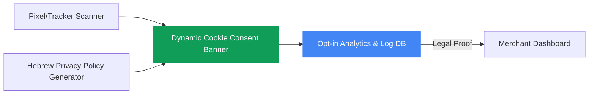

# Israeli Privacy Protection Law (Amendment 13) Compliance Shield
## Problem Definition & POC Planning Foundation

This document serves as the foundational research and blueprint for planning a Proof of Concept (POC) for a localized compliance SaaS targeting Israeli e-commerce merchants.

---

## 1. Executive Summary & Legal Context
On **August 14, 2025**, Amendment 13 to the Israeli Privacy Protection Law (חוק הגנת הפרטיות - תיקון 13) came into full effect. This amendment is the Israeli equivalent of GDPR/CCPA, modernizing privacy regulations for the digital age.

### Core Legal Requirements for E-commerce:
*   **Explicit Consent for Tracking:** Websites using cookies, pixels (Meta, TikTok), or analytics (GA4, Hotjar) must obtain explicit, informed user consent before firing tracking scripts.
*   **Form Consent:** Every web form (contact form, newsletter sign-up, checkout) must have a clear disclosure explaining what data is collected, who has access, and how to opt out.
*   **Registration & Data Storage:** Secure database logging of user consent timestamps to serve as legal proof of compliance.
*   **Updated Privacy Policy:** Privacy policies must detail Israeli-specific clauses regarding local data processing and data sharing.

---

## 2. Customer Pain & Sentiment (How Users Experience It)
Based on direct user quotes from the target merchant audience, the problem manifests as four distinct psychological and operational pain points:

### Pain Point A: The Fear of "Serial Plaintiffs" (תובעים סדרתיים)
Merchants live in fear of targeted extortion. Professional plaintiffs use bots or manual audits to find small e-commerce stores using tracking pixels without active consent banners, sending immediate settlement demands (10,000 to 50,000 NIS) backed by spam and accessibility law precedents.
> **User Quote:** *"An site with a form, pixel, or analytics without structured disclosure = invitation for serial plaintiffs."*
> **User Quote:** *"As someone who has been sued in the past over the Spam Law by a serial plaintiff, I am much more alert and prefer not to put a healthy head in a sick bed."*

### Pain Point B: The "Compliance vs. ROAS" Dilemma
Setting up strict GDPR-style cookie blockages breaks ad attribution, causing a **25% to 35% drop in measured conversions**. Facebook and Google algorithms, starved of data, start optimization loops from scratch, driving up customer acquisition costs (CPA).
> **User Quote:** *"And we didn't say goodbye to 25%-35% of conversions [by implementing strict cookie compliance]?"*

### Pain Point C: Information Paralysis & Legalese
The Ministry of Justice published a dense, 27-page legal document. Merchants cannot extract actionable tasks. Consulting tech lawyers costs thousands of shekels, while free AI tools (like ChatGPT) give conflicting advice.
> **User Quote:** *"I read the 27 pages published by the Ministry of Justice several times — from too many words it is hard to find the main point."*
> **User Quote:** *"I ran the law through Claude, we couldn't find an explicit requirement in the law to pop up a cookie banner... so is it allowed without a button or not?"*

### Pain Point D: The Copy-Paste & ChatGPT Legal Trap
Desperate to avoid lawyer fees, merchants copy policies from competitors (resulting in copyright infringement and incorrect corporate details) or generate generic policy documents via ChatGPT that ignore Israeli jurisdictional nuances.
> **User Quote:** *"I encountered a worrying phenomenon: People generating policy pages from ChatGPT, or copying (violating copyright) from other sites without even changing the original company details..."*

---

## 3. Ideal Customer Profile (ICP) for the POC
*   **Segment:** Small-to-Medium B2C E-commerce sites in Israel.
*   **Platforms:** Shopify (dominant) and WooCommerce (highly customized).
*   **Operator Profile:** Owner-operators doing self-management ("1.a" profile) without a dedicated legal department or in-house IT team.
*   **Budget Sensitivity:** High. Willing to pay a small monthly subscription (49–149 NIS/month) for a "set-and-forget" peace-of-mind solution, but cannot afford a 5,000+ NIS lawyer retainer.

---

## 4. POC Product Scope (The Lean MVP)
To solve these pains without building a complex enterprise compliance platform (like OneTrust), the POC must focus on three core pillars:



1.  **Automated Pixel Scanner:** A 1-click scan that crawls the store, detects active pixels (Meta, Google, TikTok, Hotjar), and classifies them.
2.  **High-Opt-In Hebrew Cookie Banner:** A localized banner optimized for Hebrew UI/UX. It must maximize opt-in rates (minimizing conversion loss to <10%) through persuasive Hebrew copywriting and placement, while maintaining legal compliance.
3.  **Proof-of-Consent Database:** A secure, tamper-proof log (IP hash, timestamp, accepted cookies) that the merchant can export to throw out frivolous lawsuit demands from serial plaintiffs immediately.
4.  **Localized Privacy Policy Generator:** A simple form that generates a dynamic, legally compliant Hebrew privacy policy, automatically updating when the pixel scanner detects new tracking scripts.

---

## 5. External Research & Benchmarking Prompt
Copy and paste the prompt below into an advanced LLM (such as Claude 3.5 Sonnet, Gemini 1.5 Pro, or GPT-4o) with web browsing capabilities to gather market intelligence and benchmarks:

```markdown
You are a senior product manager and B2B SaaS researcher specializing in the Israeli e-commerce tech ecosystem. I am building a localized Privacy Compliance SaaS (cookie banners, consent logs, privacy policy generation) tailored specifically for Israeli Shopify/WooCommerce merchants following the enforcement of "Amendment 13" (תיקון 13 לחוק הגנת הפרטיות).

Conduct deep research and compile a report addressing the following areas. Use web search to fetch real examples, pricing, and news from the Israeli market (primarily in Hebrew):

1. **Competitor Landscaping:**
   - Identify existing localized solutions in Israel offering cookie consent banners or privacy policy management (e.g., look for local players, specialized digital law firms offering automated generators, or general international players like Cookiebot/OneTrust adapted for Hebrew).
   - What are their pricing models (monthly subscription vs. one-time fees)?
   - What are their primary marketing angles (e.g., "anti-lawsuit shield", "serial plaintiffs protection")?

2. **Lawsuit Benchmarks (The "Fear" Metric):**
   - Find news articles, legal alerts, or court records in Israel regarding lawsuits filed under Amendment 13 or the Privacy Protection Law in 2025/2026.
   - What is the typical settlement amount demanded by "serial plaintiffs" (תובעים סדרתיים) for privacy violations on e-commerce sites?
   - How does this compare to past waves of accessibility (נגиשות) or spam (חוק הספאם) lawsuits in Israel?

3. **Technical Benchmarks (Consent Optimization):**
   - Find industry benchmarks or case studies showing the average conversion/tracking loss (opt-out rates) when implementing a strict cookie consent banner.
   - What UX patterns or legal copywriting techniques (especially in Hebrew) are being used today to minimize this data loss (maximizing opt-in rates) while remaining compliant?

4. **Integration Ecosystem:**
   - How are Wix, Shopify, and WooCommerce store owners in Israel currently implementing these changes? Are they using general Shopify App Store apps, or are they coding custom solutions?
   - What are the main limitations of international apps (e.g., language translation errors, lack of Hebrew legal compliance clauses)?

Format your response in structured markdown with clear headings, tables for comparison where appropriate, and cite the names/sources of local companies or news outlets you discover.
```
